*National University of Computer and Emerging Science*

`                                      `**Software Design and Analysis**                                                            

`                                                                            `**(CS3004)**

**Software Design and Analysis**                                                            

**E-Commerce Applications**
**

vii

# **Table of Contents**
[**1. INTRODUCTION:	8****](#_toc184327666)**

[**2. VISION DOCUMENT:	8****](#_toc184327667)

[2.1 Problem Statement:	8](#_toc184327668)

[2.2 Business Opportunity:	8](#_toc184327669)

[2.3 Objectives:	9](#_toc184327670)

[2.4 Scope:	9](#_toc184327671)

[2.5 Constraints:	9](#_toc184327672)

[2.6 Stakeholder and User Descriptions:	10](#_toc184327673)

[*2.6.1. Market Demographics:	10**](#_toc184327674)

[*2.6.2. Stakeholder Summary:	10**](#_toc184327675)

[*2.6.3. User Environment:	11**](#_toc184327676)

[*2.6.4 Stakeholder Profiles:	11**](#_toc184327677)

[**3. SYSTEM REQUIREMENTS SPECIFICATION:	13****](#_toc184327678)

[3.1. System Features:	13](#_toc184327679)

[*Core AI-Powered Features	13**](#_toc184327680)

[Dynamic Pricing System	13](#_toc184327681)

[AI-Driven Recommendations	13](#_toc184327682)

[Demand Forecasting	14](#_toc184327683)

[*User Management Features	14**](#_toc184327684)

[Account Management	14](#_toc184327685)

[Authentication & Access Control	14](#_toc184327686)

[Multi-Device Support	14](#_toc184327687)

[*Shopping Experience Features	14**](#_toc184327688)

[Product Catalog	14](#_toc184327689)

[Shopping Cart	15](#_toc184327690)

[Wishlist Management	15](#_toc184327691)

[Customer Support	15](#_toc184327692)

[*Business Operations Features	15**](#_toc184327693)

[Inventory Management	15](#_toc184327694)

[Order Processing	15](#_toc184327695)

[Analytics	15](#_toc184327696)

[*System Performance Feature	16**](#_toc184327697)

[Technical Specifications	16](#_toc184327698)

[Security Measures	16](#_toc184327699)

[Scalability	16](#_toc184327700)

[3.2. Functional Requirements:	16](#_toc184327701)

[*3.2.1  Dynamic Pricing System	16**](#_toc184327702)

[*3.2.2  Real-Time Inventory Management	16**](#_toc184327703)

[*3.2.3  Personalized Product Recommendations	16**](#_toc184327704)

[*3.2.4  User Account Management	16**](#_toc184327705)

[*3.2.5  Product Catalog Management	16**](#_toc184327706)

[*3.2.6  Order Processing	16**](#_toc184327707)

[*3.2.7  Payment Gateway Integration	17**](#_toc184327708)

[*3.2.8  Cart Management	17**](#_toc184327709)

[*3.2.9  Discount Management	17**](#_toc184327710)

[*3.2.10  Customer Feedback and Reviews	17**](#_toc184327711)

[*3.2.11  Search and Filter	17**](#_toc184327712)

[*3.2.12  Notification System	17**](#_toc184327713)

[*3.2.13  User Authentication	17**](#_toc184327714)

[*3.2.14  Role-Based Access Control	17**](#_toc184327715)

[*3.2.15  Sales Analytics	17**](#_toc184327716)

[*3.2.16  AI-Powered Demand Forecasting	17**](#_toc184327717)

[*3.2.17  Multi-Device Support	17**](#_toc184327718)

[*3.2.18  Wishlist Management	18**](#_toc184327719)

[*3.2.19  Order History	18**](#_toc184327720)

[*3.2.20  Integration with Third-Party Tools	18**](#_toc184327721)

[*3.2.21  Customer Support Chat	18**](#_toc184327722)

[*3.2.22  Shipping Management	18**](#_toc184327723)

[*3.2.23  Product Availability Alerts	18**](#_toc184327724)

[*3.2.24  Return and Refund Processing	18**](#_toc184327725)

[*3.2.25  Multi-Language Support:	18**](#_toc184327726)

[3.3. Non-Functional Requirements:	18](#_toc184327727)

[*3.2.1  Scalability	18**](#_toc184327728)

[*3.2.2  Performance	18**](#_toc184327729)

[*3.2.3  Availability	18**](#_toc184327730)

[*3.2.4  Security	19**](#_toc184327731)

[*3.2.5  Usability	19**](#_toc184327732)

[*3.2.6  Compatibility	19**](#_toc184327733)

[*3.2.7  Data Privacy	19**](#_toc184327734)

[*3.2.8  Maintainability	19**](#_toc184327735)

[*3.2.9  Reliability	19**](#_toc184327736)

[*3.2.10  Responsiveness	19**](#_toc184327737)

[*3.2.11  Backup and Recovery	19**](#_toc184327738)

[*3.2.12  Extensibility	19**](#_toc184327739)

[*3.2.13  High Computational Power	19**](#_toc184327740)

[*3.2.14  Load Handling	19**](#_toc184327741)

[*3.2.15  Legal Compliance	20**](#_toc184327742)

[*3.2.16  Auditability	20**](#_toc184327743)

[*3.2.17  User Satisfaction	20**](#_toc184327744)

[*3.2.18  Deployment	20**](#_toc184327745)

[*3.2.19  Localization	20**](#_toc184327746)

[*3.2.20  Accessibility	20**](#_toc184327747)

[**5. USE CASE SPECIFICATION:	22****](#_toc184327748)

[**6. ARCHITECTURE DESIGN	43****](#_toc184327749)

[**7. DOMAIN MODEL	44****](#_toc184327750)

[**8. ACTIVITY DIAGRAM	45****](#_toc184327751)

[**9. SYSTEM SEQUENCE DIAGRAM	47****](#_toc184327752)

[**10. STATE MACHINE	48****](#_toc184327753)

[**11. CLASS DIAGRAM	49****](#_toc184327754)

[**12. SEQUENCE DIAGRAM	50****](#_toc184327755)

[**13. OPERATION CONTRACTS	51****](#_toc184327756)

[13.1 Process Order	51](#_toc184327757)

[13.2 Manage Inventory	51](#_toc184327758)

[13.3 Calculate Dynamic Price	52](#_toc184327759)

[13.4 Generate Recommendation	52](#_toc184327760)

[13.5 Process Shipment	52](#_toc184327761)

[13.6 Manage Wishlist	53](#_toc184327762)

[13.7 Track Order	53](#_toc184327763)

[13.8 Process Payment	54](#_toc184327764)

[13.9 Update Product Catalog	54](#_toc184327765)

[**14. COMMUNICATION/COLLABORATION DIAGRAM:	55****](#_toc184327766)

[**15. COMPONENT DIAGRAM:	56****](#_toc184327767)

[**16. PACKAGE DIAGRAM:	57****](#_toc184327768)

[**17. DEPLOYMENT DIAGRAM:	58****](#_toc184327769)

[**18. DATA FLOW DIAGRAM	58****](#_toc184327770)

[18.1 Level 0:	58](#_toc184327771)

[18.2 Level 1:	58](#_toc184327772)

[18.3 Level 2:	58](#_toc184327773)

[**19. GOF (DESIGN PATTERNS):	59****](#_toc184327774)

[19.1 Creational Patterns (Singleton Pattern):	59](#_toc184327775)

[*19.1.1. Admin Class: Singleton Pattern	59**](#_toc184327776)

[*19.1.2. AI System Class: Singleton Pattern	60**](#_toc184327777)

[*19.1.3. Payment Class: Singleton Pattern	61**](#_toc184327778)

[19.2 Structural Patterns (Adapter Pattern):	62](#_toc184327779)

[*19.2.1. Payment Gateway Class: Adapter Pattern	62**](#_toc184327780)

[19.3 Behavioral Patterns (Observer Pattern):	64](#_toc184327781)

[*19.3.1.  Inventory Class: Adapter Pattern	64**](#_toc184327782)

[**20. GRASP (DESIGN PATTERNS):	66****](#_toc184327783)

[20.1 Creator:	66](#_toc184327784)

[*20.1.1.  Vendor and Product	66**](#_toc184327785)

[*20.2.2.  Inventory and Product	66**](#_toc184327786)

[20.2 Information Expert:	67](#_toc184327787)

[20.3 Controller:	68](#_toc184327788)

[20.4 Low Coupling:	69](#_toc184327789)

[20.5 High Cohesion:	70](#_toc184327790)

[20.6 Polymorphism:	71](#_toc184327791)

[20.7 Pure Fabrication:	72](#_toc184327792)

[20.8 Indirection:	73](#_toc184327793)

#####

# **1. Introduction:**
`	`SmartShop is an online shopping platform that uses AI to help business easily manage their product prices and inventory. It automatically adjusts prices based on factors like how many items are in stock, how a product is popular and customer interest. For example, if many people are interested in a certain item but there are only a few lefts, SmartShop may increase the price. If there is plenty of stock but some buyers. It can lower the price to attract more customers.

The platform also gives recommendations to customers according to person suggesting products it is based on their past purchases or browsing history(cookies). This makes shopping more comfortable and according to each customer taste.

In addition to making shopping easy for customers. SmartShop helps businesses run smoothly by tracking inventory in real time and setting smart prices that match current demand. It saves time for store owners. Who not have to constantly monitor stock or guess the best prices. 

SmartShop is built to improve both the shopping experience and business operations by using AI. That adapts quickly to changes in what customers want and how products are selling. It is designed to make running an online store easily while giving customers a better and more personalized experience.
# **2. Vision Document:**
## `  `**2.1 Problem Statement:**
`	`Businesses need a simple way to manage product prices and inventory in real time while giving customers a personalized shopping experience. Manually checking stock and adjusting prices takes a lot of time and can lead to mistakes.

`	`Customers also expect to see product suggestions that match their preferences, making personalized shopping important. 

`	`The challenge is to automatically adjust prices based on demand and stock, while also keeping track of inventory in real time. Businesses need a solution that makes these tasks easier and improves the shopping experience with less manual work.

## **2.2 Business Opportunity:**
` 		`With the rise of AI and data-driven decision-making, businesses can now leverage technology to improve customer satisfaction and operational efficiency. SmartShop offers a significant opportunity for online retailers to gain a competitive edge by adopting AI-powered pricing models, better inventory management, and personalized shopping experiences. 

`	`By using these features, online retailers can increase the number of people who buy products, keep customers loyal, and make more money. In simple terms, SmartShop helps businesses work smarter, attract more buyers, and earn higher profits.
## **2.3 Objectives:**
- Develop a platform that can dynamically adjust prices based on factors such as demand, stock levels, and customer behavior.
- Provide real-time inventory management to help businesses avoid stockouts or overstock situations.
- Enhance user experience through personalized product recommendations.
- Ensure scalability to support business growth and manage increasing customer demand.
- Improve overall business performance through data-driven insights and analytics.
## **2.4 Scope:**

`	`SmartShop is designed to support both small and large e-commerce businesses. The platform will include features like AI-driven pricing that automatically adjusts based on stock levels and demand, real-time inventory tracking, and personalized product recommendations to enhance customer satisfaction. 

`	`It will be user-friendly, allowing businesses without technical expertise to manage their stores easily. Additionally, SmartShop will be flexible and scalable, enabling it to grow and adapt alongside businesses as they expand.
**

## **2.5 Constraints:**

- The platform must integrate with existing e-commerce tools and systems.
- Real-time data analysis may require high computational power and resources.
- Compliance with legal and privacy regulations, especially concerning customer data, must be ensured.
- The platform should work across multiple devices and operating systems to cater to diverse user bases.

## **2.6 Stakeholder and User Descriptions:**
### **2.6.1. Market Demographics:**

`	`Market demographics is all about figuring out which one is your potential customers. these customers including:

People of different ages shop differently. Young customers might be into the latest trends while older customer may prefer practical items. Knowing the age of your audience helps you pick the right products.

`	`Men and women often have different shopping habits. For example, women might spend more time comparing products, while men may prefer to make quicker decisions. Your marketing to different genders can help connect with your audience better.

`	`Where your customers live can change their shopping preferences. People in cities may want fast delivery, while those in rural areas might focus more on price. Knowing your audience's location helps with shipping and marketing.

A customer's education level can influence how they shop. More educated shoppers might do a lot of research before buying, while others might rely on word of mouth recommendations. Understanding this can help you present your products better.
### `                `**2.6.2. Stakeholder Summary:**

|**Name**|**Description**|**Responsibilities**|
| :- | :- | :- |
|**Business Owners/Operators**|
Looking to optimize pricing and inventory management.

|Ensure effective use of the platform to improve pricing strategies and inventory management processes.|
|**IT Teams**|
Responsible for integrating and maintaining the platform

|Ensure smooth integration, ongoing support, and system updates for the platform.|
|**Customers**|
Expecting a seamless, personalized shopping experience.

|Provide feedback on the platform’s usability and personalization features.|
|**Investors**|Interested in the platform's potential for business growth and profitability.|Monitor the platform's performance and potential return on investment.|
### `               `**2.6.3. User Environment:** 

`	`The user environment is about the setting where customers shop online and how it affects their experience. Here are the key parts:

`	`Customers use various devices, like smartphones, tablets, and computers. Each device has a different screen size and layout. Your website or app must work smoothly on all these devices to keep shoppers happy.

`	`Where customers are when they shop also matters. Are they at home, in a coffee shop, or on public transport? This can affect how long they spend shopping and what they choose to buy. Someone on the go might prefer quick and easy purchases

`	`How customers feel while shopping is super important. If they feel comfortable and trust your platform, they’re more likely to buy something. Factors like convenience and overall comfort level play a big role here.

### **2.6.4 Stakeholder Profiles:**

**Customers:**

- **Type**: Primary
- **Responsibilities**: Purchase products, provide feedback, engage with features
- **Success Criteria**: Satisfaction with selection, pricing, and experience
- **Involvement**: High
- **Key Issue**: Ensure a user-friendly platform

**Business Owners:**

- **Type**: Primary
- **Responsibilities**: Make strategic decisions, oversee operations, monitor performance
- **Success Criteria**: Sales growth, profitability, inventory efficiency
- **Involvement**: High
- **Key Issue**: Provide actionable insights

**Product Managers:**

- **Type**: Secondary
- **Responsibilities**: Define requirements, manage development, ensure alignment with goals
- **Success Criteria**: Successful product launches and adoption
- **Involvement**: Medium
- **Key Issue**: Ensure product-market fit

**Developers:**

- **Type**: Secondary
- **Responsibilities**: Analyze data, provide insights, support decisions
- **Success Criteria**: Accurate analysis, actionable insights
- **Involvement**: Medium
- **Key Issue**: Ensure data privacy

**Marketing Team:**

- **Type**: Secondary
- **Responsibilities**: Promote the platform, manage campaigns
- **Success Criteria**: Brand awareness, customer acquisition
- **Involvement**: Medium
- **Key Issue**: Consistent branding

**IT Support:**

- **Type**: Secondary
- **Responsibilities**: Resolve technical issues, maintain security
- **Success Criteria**: Uptime, user satisfaction
- **Involvement**: Medium
- **Key Issue**: Timely issue resolution

**Investors:**

- **Type**: External
- **Responsibilities**: Monitor performance, assess returns
- **Success Criteria**: Profitability, growth
- **Involvement**: Low
- **Key Issue**: Clear communication on progress and concerns
# **3. System Requirements Specification:**
## **3.1. System Features:**
### **Core AI-Powered Features**
#### *Dynamic Pricing System*
- Automatically adjusts product prices
- Demand levels
- Current inventory
- Customer behavior patterns
- Helps maximize sales and profit margins

#### *AI-Driven Recommendations*
- Personalizes product suggestions
- Past purchase history
- Browsing behavior
- Similar user preferences
- Enhances user experience and increases sales
#### *Demand Forecasting*
- ` `Uses AI to predict future product demand
- ` `Inventory planning
- ` `Stock level optimization
- ` `Reducing overstock/stockout situations

### **User Management Features**
#### *Account Management*
- User account creation and modification
- Profile customization
- Account deletion capability

#### *Authentication & Access Control*
- Secure login system
- Role based access
- Customer access
- Business owner privileges
- IT team capabilities
- Ensures data security and appropriate access levels

#### *Multi-Device Support*
- Compatible
- Mobile devices
- Tablets
- Desktop computers
- Responsive design for all screen sizes

### **Shopping Experience Features**
#### *Product Catalog*
- Comprehensive product listings
- Search and filter capabilities
- Category-based organization

#### *Shopping Cart*
- Add/remove items
- Modify quantities
- Save for later option

#### *Wishlist Management*
- Save desired items
- Easy transfer to shopping cart
- Share Wishlist capability

#### *Customer Support*
- Live chat support
- Order tracking
- FAQs and help documentation

### **Business Operations Features**
#### *Inventory Management*
- Real time stock tracking
- Automatic reorder notifications
- Prevents overselling

#### *Order Processing*
- End to end order management
- Status updates
- Return and refund handling

#### *Analytics*
- Sales data analysis
- Customer behavior insights
- Performance metrics

### **System Performance Feature**
#### *Technical Specifications*
- 3 second response time
- 99.9% uptime guarantee
- Supports 10,000 concurrent users
#### *Security Measures*
- Industry standard security protocols
- GDPR compliance
- Secure payment processing

#### *Scalability*
- Cloud deployment
- Handles growing user base
- Easily extendable architecture
## **3.2. Functional Requirements:**

### **3.2.1  Dynamic Pricing System**
The system shall adjust product prices automatically based on factors like demand, stock levels, and customer behavior.
### **3.2.2  Real-Time Inventory Management**
The system shall provide real time tracking of inventory, preventing both stockouts and overstock situations.
### **3.2.3  Personalized Product Recommendations**
The system shall suggest products to users based on their past purchases, browsing history, and other behavioral data.
### **3.2.4  User Account Management**
Users shall be able to create, update, and delete their accounts on the platform.
### **3.2.5  Product Catalog Management**
Business owners shall be able to add, update, and remove products from the platform.
### **3.2.6  Order Processing**
The system shall allow users to place orders, which shall be tracked from order placement to delivery.
### **3.2.7  Payment Gateway Integration**
The platform shall integrate with various payment gateways to support multiple payment options.
### **3.2.8  Cart Management**
Users shall be able to add, remove, and modify products in their shopping cart.
### **3.2.9  Discount Management**
Business owners shall be able to create and manage discounts and promotions, which will be applied automatically at checkout.
### **3.2.10  Customer Feedback and Reviews**
Users shall be able to provide product feedback and ratings, which will be displayed on the product page.
### **3.2.11  Search and Filter**
Users shall be able to search and filter products based on categories, price, and other attributes.
### **3.2.12  Notification System**
Users shall receive notifications for order updates, promotions, and other relevant events.
### **3.2.13  User Authentication**
The system shall require users to authenticate using their credentials for secure access.
### **3.2.14  Role-Based Access Control**
Different roles (e.g., business owners, IT teams, customers) shall have access to different functionalities based on their permissions.
### **3.2.15  Sales Analytics**
The platform shall provide business owners with sales analytics and insights to help make data driven decisions.
### **3.2.16  AI-Powered Demand Forecasting**
The system shall use AI to forecast product demand, assisting business owners in inventory planning.
### **3.2.17  Multi-Device Support**
The platform shall support browsing and transactions on mobile, tablet, and desktop devices.
### **3.2.18  Wishlist Management**
Users shall be able to add products to a wishlist for future reference.
### **3.2.19  Order History**
Users shall be able to view their past orders and reorder items if needed.
### **3.2.20  Integration with Third-Party Tools**
The system shall integrate with existing e-commerce tools, such as ERP systems.
### **3.2.21  Customer Support Chat**
The platform shall provide customer support through chat for user assistance.
### **3.2.22  Shipping Management**
The system shall allow business owners to manage shipping options and track shipments.
### **3.2.23  Product Availability Alerts**
Users shall be notified when a previously unavailable product is back in stock.
### **3.2.24  Return and Refund Processing**
Users shall be able to request returns and refunds directly through the platform.
### **3.2.25  Multi-Language Support:** 
The platform shall support multiple languages to cater to diverse user bases.

## **3.3. Non-Functional Requirements:**

### **3.2.1  Scalability**
The platform must be scalable to handle an increasing number of users and transactions as the business grows.
### **3.2.2  Performance**
The system must respond to user interactions within 3 seconds, even under high load conditions.
### **3.2.3  Availability**
The platform must be available 99.9% of the time, ensuring minimal downtime.
### **3.2.4  Security**
The platform must comply with industry standards to ensure data security and privacy, including secure payment processing.
### **3.2.5  Usability**
The platform must be user-friendly, ensuring that users without technical expertise can easily navigate and use all features.
### **3.2.6  Compatibility**
The platform must be compatible with major browsers and operating systems.
### **3.2.7  Data Privacy**
The system must comply with relevant data protection regulations, such as GDPR, to ensure the privacy of user data.
### **3.2.8  Maintainability**
The system should be easy to maintain, allowing IT teams to implement updates and fix issues efficiently.
### **3.2.9  Reliability**
The platform must ensure that critical functions like order placement and payment processing work reliably without failure.
### **3.2.10  Responsiveness**
The UI must be responsive to work seamlessly across devices of different screen sizes.
### **3.2.11  Backup and Recovery**
The system must implement regular backups and ensure data recovery in case of failures.
### **3.2.12  Extensibility**
The platform should be designed in a way that new features can be added with minimal changes to existing components.
### **3.2.13  High Computational Power**
Real-time data analysis should be supported by adequate computational resources to ensure smooth functioning.
### **3.2.14  Load Handling**
The system must support up to 10,000 concurrent users without performance degradation.
### **3.2.15  Legal Compliance**
The platform must comply with local and international e-commerce regulations and legal requirements.
### **3.2.16  Auditability**
All significant events, such as user account changes and transactions, must be logged for audit purposes.
### **3.2.17  User Satisfaction**
The platform must aim for a high user satisfaction rate, measured through user feedback and ratings.
### **3.2.18  Deployment**
The system must support cloud deployment to ensure flexibility and scalability.
### **3.2.19  Localization**
The platform must be capable of adapting its content to various regions and cultures.
### **3.2.20  Accessibility**
The platform should follow accessibility standards to ensure that people with disabilities can use it effectively.

4\. **Use Case Diagram:**

# **5. Use Case Specification:**

|**USE CASE ID**|**1**|
| :-: | :-: |
|**Use Case Name**|
Manage Account

|
|**Actors**|Customer|
|**Type**|Primary|
|**Description**|Allows customers to create, update, and manage their user profiles.|
|**Pre-Conditions**|
`                            `Customer must be logged in

|
|**Post-Conditions**|Account is created or updated in the system.|
|**Main Scenario**|
1. Customer selects account management option

2. System displays account options

3. Customer performs desired action (create/update/delete)

4. System validates and saves changes

|
|**Alternate Scenario**|
- Account creation fails due to existing email

- Validation errors in provided information

|
|**Frequency of Use**|High |

|**USE CASE ID**|**2**|
| :-: | :-: |
|**Use Case Name**|Browse Products |
|**Actors**|Customer|
|**Type**|Primary|
|**Description**|Enables customers to search, filter, and view products.   |
|**Pre-Conditions**|-|
|**Post-Conditions**|Customer views relevant products|
|**Main Scenario**|
1. Customer enters search criteria or browses categories

2. System displays matching products

3. Customer can sort or filter results

4. System updates display based on filters

.
|
|**Alternate Scenario**|
No products match search criteria

|
|**Frequency of Use**|Very High |
|**Includes**|
Generate Recommendations

|

|**USE CASE ID**|**3**|
| :-: | :-: |
|**Use Case Name**|Manage Product|
|**Actors**|
Business Owner

|
|**Type**|Primary|
|**Description**|Allows adding, updating, or removing products from the catalog|
|**Pre-Conditions**|
Business Owner is authenticated

|
|**Post-Conditions**|Catalog is updated |
|**Main Scenario**|
1. Owner selects catalog management

2. System displays current catalog

3. Owner performs desired action (add/update/remove)

4. System validates and processes changes

|
|**Alternate Scenario**|
- Product validation fails

- Duplicate product SKU

|
|**Frequency of Use**|Medium |

|**USE CASE ID**|**4**|
| :-: | :-: |
|**Use Case Name**|Manage Pricing|
|**Actors**|Business Owner|
|**Type**|Primary|
|**Description**|Configure dynamic pricing rules and override automated prices|
|**Pre-Conditions**|
Business Owner is authenticated

|
|**Post-Conditions**|
- Pricing rules are updated

- Notifications are sent for significant price changes

|
|**Main Scenario**|
1. Owner accesses pricing management

2. System displays current pricing rules

3. Owner modifies rules or sets manual prices

4. System applies new pricing logic

|
|**Alternate Scenario**|Invalid pricing rule configuration|
|**Frequency of Use**|Medium |
|**Includes**|Send Notifications|

|**USE CASE ID**|**5**|
| :-: | :-: |
|**Use Case Name**|Process Payments|
|**Actors**|Payment System |
|**Type**|Essential|
|**Description**|Handles secure payment processing for orders |
|**Pre-Conditions**|Valid order is initiated |
|**Post-Conditions**|
Order payment status is updated

|
|**Main Scenario**|
1. System initiates payment processing

2. Payment gateway validates payment details

3. Transaction is processed

4. System updates order status 
|
|**Alternate Scenario**|
- Payment declined

- Gateway timeout
|
|**Frequency of Use**|High |

|**USE CASE ID**|**6**|
| :-: | :-: |
|**Use Case Name**|Update Inventory|
|**Actors**|Inventory System|
|**Type**|Essential|
|**Description**|Automatically adjusts inventory levels based on sales and restocking|
|**Pre-Conditions**|Inventory change trigger (sale/restock)|
|**Post-Conditions**|
- Inventory levels are updated

- Low stock notifications sent if applicable
|
|**Main Scenario**|
1. System receives inventory update trigger

2. Current inventory levels are checked

3. Levels are adjusted accordingly

4. If thresholds are met then notifications are generated
|
|**Alternate Scenario**|
Inventory update conflict

|
|**Frequency of Use**|Very High |

|**USE CASE ID**|**7**|
| :-: | :-: |
|**Use Case Name**|Manage Cart|
|**Actors**|Customer|
|**Type**|Primary|
|**Description**|Allows customers to add, update, or remove items in their shopping cart.|
|**Pre-Conditions**|Customer is logged in.|
|**Post-Conditions**|Cart is updated with the customer’s selected items.|
|**Main Scenario**|
1. Customer selects items to add to the cart.

2. System adds selected items to the cart.

3. Customer reviews and modifies cart as needed.

4. System updates cart details accordingly.
|
|**Alternate Scenario**|
- Item is out of stock.

- Quantity exceeds available stock.
|
|**Frequency of Use**|High|

|**USE CASE ID**|**8**|
| :-: | :-: |
|**Use Case Name**|Place Order|
|**Actors**|Customer|
|**Type**|Primary|
|**Description**|Allows customers to confirm and place their order|
|**Pre-Conditions**|Customer has items in the cart|
|**Post-Conditions**|Order is confirmed and recorded in the system|
|**Main Scenario**|
1. Customer reviews cart and proceeds to checkout.

2. System displays order summary and payment options.

3. Customer confirms order and payment.

4. System processes the order and provides confirmation.
|
|**Alternate Scenario**|
- Payment fails.

- Customer cancels the order.
|
|**Frequency of Use**|High|

|**USE CASE ID**|**9**|
| :-: | :-: |
|**Use Case Name**|Track Order|
|**Actors**|Customer|
|**Type**|Primary|
|**Description**|Allows customers to view the status of their orders|
|**Pre-Conditions**|Customer has placed an order|
|**Post-Conditions**|Order status is displayed|
|**Main Scenario**|
1. Customer selects order tracking option

2. System displays current order status and details
|
|**Alternate Scenario**|Order status is unavailable|
|**Frequency of Use**|Moderate|

|**USE CASE ID**|**10**|
| :-: | :-: |
|**Use Case Name**|Manage Product Category|
|**Actors**|Business Owner|
|**Type**|Secondary|
|**Description**|Allows business owners to organize products into categories|
|**Pre-Conditions**|Business owner is logged in|
|**Post-Conditions**|Categories are updated or created in the system|
|**Main Scenario**|
1. Business owner selects category management option

2. System displays category options.

3. Business owner creates or updates categories.

4. System saves category changes.
|
|**Alternate Scenario**|Category name already exists|
|**Frequency of Use**|Moderate|

|**USE CASE ID**|**11**|
| :-: | :-: |
|**Use Case Name**|Manage AI Setting|
|**Actors**|Business Owner|
|**Type**|Secondary|
|**Description**|Enables the business owner to configure AI-based recommendations|
|**Pre-Conditions**|Business owner is logged in|
|**Post-Conditions**|AI settings are updated in the system|
|**Main Scenario**|
1. Business owner accesses AI setting management.

2. System displays AI configuration options.

3. Business owner adjusts settings.

4. System saves the changes.
|
|**Alternate Scenario**|Invalid AI configuration settings|
|**Frequency of Use**|Low|

|**USE CASE ID**|**12**|
| :-: | :-: |
|**Use Case Name**|Maintain System|
|**Actors**|Admin|
|**Type**|Secondary|
|**Description**|Allows the admin to perform system maintenance to ensure smooth platform operations|
|**Pre-Conditions**|Admin is logged in|
|**Post-Conditions**|System is maintained and optimized for performance|
|**Main Scenario**|
1. Admin selects system maintenance options

2. System performs maintenance tasks

3. Admin reviews maintenance reports

4. System updates status to reflect completed maintenance
|
|**Alternate Scenario**|
- Maintenance fails due to an error.

- System performance issues detected
|
|**Frequency of Use**|Low|

|**USE CASE ID**|**13**|
| :-: | :-: |
|**Use Case Name**|Support User|
|**Actors**|Admin|
|**Type**|Primary|
|**Description**|Allows the admin to assist users with their queries and issues|
|**Pre-Conditions**|Admin is logged in|
|**Post-Conditions**|User query or issue is resolved|
|**Main Scenario**|
1. Admin receives a user support request

2. System displays user information and request details

3. Admin provides support or guidance to the user

4. System updates the request status as resolved
|
|**Alternate Scenario**|User issue requires further investigation|
|**Frequency of Use**|Moderate|

|**USE CASE ID**|**14**|
| :-: | :-: |
|**Use Case Name**|Generate Recommendations|
|**Actors**|AI System|
|**Type**|Secondary|
|**Description**|Generates product recommendations for customers based on browsing and purchase history|
|**Pre-Conditions**|Customer is logged in|
|**Post-Conditions**|Recommendations are displayed to the customer|
|**Main Scenario**|
1. AI system analyzes customer's past interactions.

2. System generates a list of recommended products.

3. Recommendations are displayed to the customer.
|
|**Alternate Scenario**|No relevant recommendations found|
|**Frequency of Use**|High|
#

|**USE CASE ID**|**15**|
| :-: | :-: |
|**Use Case Name**|Manage Wishlist|
|**Actors**|Customer|
|**Type**|Primary|
|**Description**|Allows customers to add, view, or remove products in their wishlist|
|**Pre-Conditions**|Customer is logged in|
|**Post-Conditions**|Wishlist is updated|
|**Main Scenario**|
1. Customer adds items to the wishlist.

2. System saves the items in the wishlist.

3. Customer views or removes items as desired.

4. System updates the wishlist.
|
|**Alternate Scenario**|Item is out of stock and cannot be added|
|**Frequency of Use**|Moderate|

|**USE CASE ID**|**16**|
| :-: | :-: |
|**Use Case Name**|Give Feedback|
|**Actors**|Customer|
|**Type**|Secondary|
|**Description**|Allows customers to provide feedback on products or services|
|**Pre-Conditions**|Customer is logged in|
|**Post-Conditions**|Feedback is saved in the system|
|**Main Scenario**|
1. Customer selects the feedback option.

2. System displays feedback form.

3. Customer enters and submits feedback.

4. System saves feedback in the database.
|
|**Alternate Scenario**|Feedback submission fails due to a network issue|
|**Frequency of Use**|Low|

|**USE CASE ID**|**17**|
| :-: | :-: |
|**Use Case Name**|Monitor Analytics|
|**Actors**|Business Owner|
|**Type**|Secondary|
|**Description**|Allows the business owner to monitor key performance metrics and analytics on the platform|
|**Pre-Conditions**|Business owner is logged in|
|**Post-Conditions**|Analytics data is displayed|
|**Main Scenario**|
1. Business owner selects the analytics monitoring option.

2. System retrieves and displays relevant metrics

3. Business owner reviews data.
|
|**Alternate Scenario**|Data unavailable due to a system issue|
|**Frequency of Use**|Moderate|

|**USE CASE ID**|**18**|
| :-: | :-: |
|**Use Case Name**|Handle Return/Refund|
|**Actors**|Business Owner|
|**Type**|Primary|
|**Description**|Allows the business owner to process product returns and refunds|
|**Pre-Conditions**|Customer has requested a return/refund|
|**Post-Conditions**|Return/refund is processed|
|**Main Scenario**|
1. Business owner reviews return/refund request.

2. System verifies eligibility for return/refund.

3. Business owner approves or rejects the request.

4. System processes refund or updates return status.
|
|**Alternate Scenario**|Request is ineligible for return/refund|
|**Frequency of Use**|Moderate|

|**USE CASE ID**|**19**|
| :-: | :-: |
|**Use Case Name**|Send Notification|
|**Actors**|System|
|**Type**|Secondary|
|**Description**|Sends notifications to customers for various events, such as order status updates or promotional offers|
|**Pre-Conditions**|Trigger event occurs|
|**Post-Conditions**|Notification is delivered to the customer|
|**Main Scenario**|
1. System detects a trigger event.

2. System generates notification content.

3. System sends notification to the customer.
|
|**Alternate Scenario**|Notification delivery fails due to connectivity issues|
|**Frequency of Use**|High|

|**USE CASE ID**|**20**|
| :-: | :-: |
|**Use Case Name**|Manage Promotions|
|**Actors**|Business Owner|
|**Type**|Secondary|
|**Description**|Allows business owners to create and manage promotional offers|
|**Pre-Conditions**|Business owner is logged in|
|**Post-Conditions**|Promotion details are updated in the system|
|**Main Scenario**|
1. Business owner selects the manage promotions option.

2. System displays current promotions.

3. Business owner creates or updates promotional offers.

4. System saves promotional details.
|
|**Alternate Scenario**|Promotion setup fails due to invalid dates or discount value|
|**Frequency of Use**|Low|

# **6. Architecture Design**

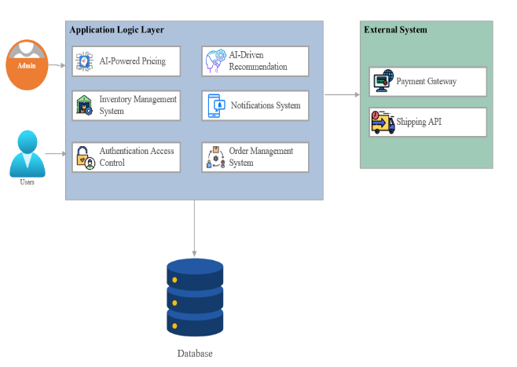

# **7. Domain Model**
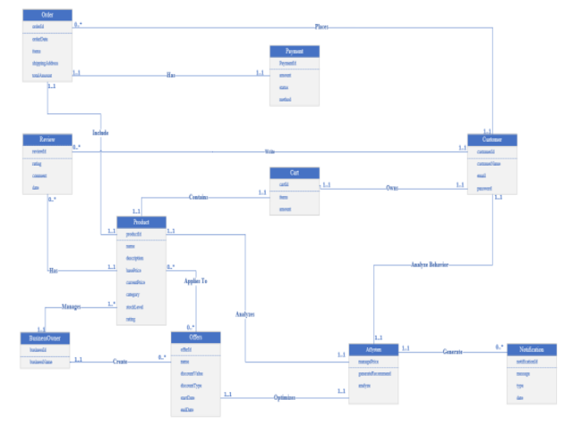

# **8. Activity Diagram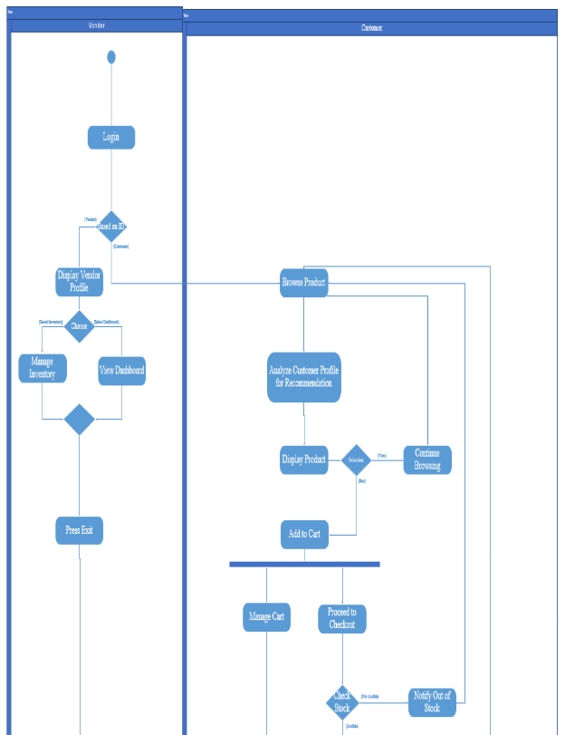**
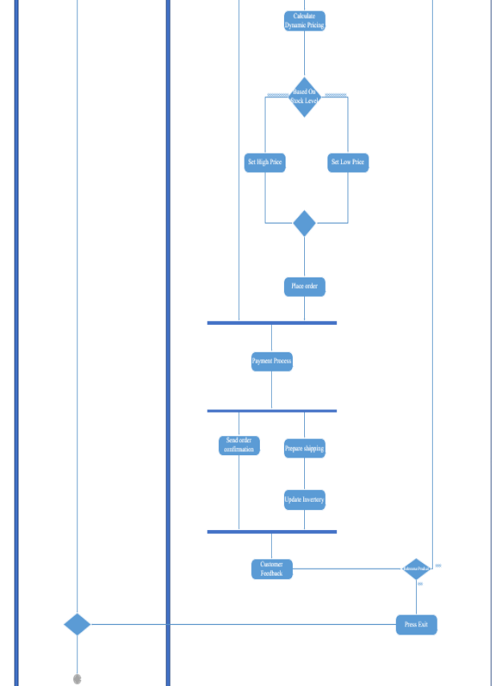
# **9. System Sequence Diagram**
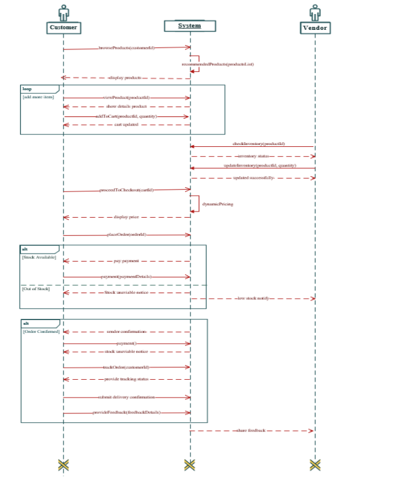

# **10. State Machine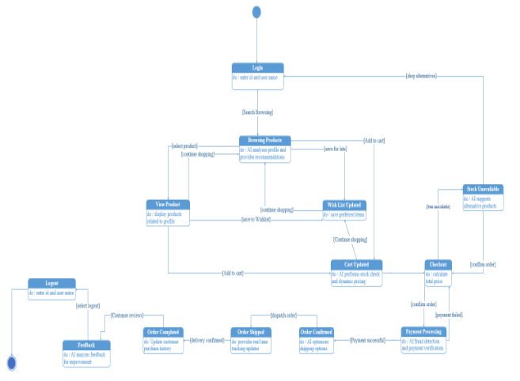**

# **11. Class Diagram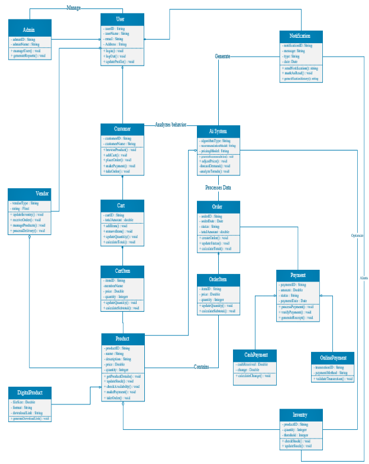**
# **12. Sequence Diagram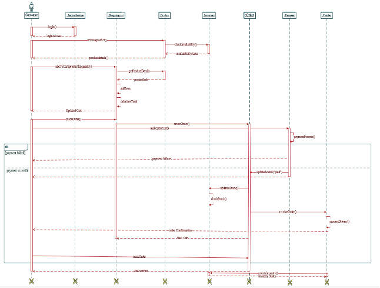**

# **13. Operation Contracts**

## **13.1 Process Order**

|**Operation**|processOrder(cartID: CartID, paymentDetails: PaymentInfo)|
| :-: | :-: |
|**Cross References**|Use Cases: Order Processing, Payment Gateway Integration|
|**Pre-condition**|Cart contains items and is valid|
|**Post-condition**|
1. Order instance was created (instance creation)

2. Payment was processed through payment gateway (association formed)

3. Inventory quantities were updated (attribute modification)

4. Order confirmation was generated (instance creation)

5. Customer notification was triggered (instance creation)
|

## **13.2 Manage Inventory**

|**Operation**|
updateInventoryLevel(productID: ProductID, quantity: integer, threshold: integer)

|
| :-: | :-: |
|**Cross References**|Use Cases: Real-Time Inventory Management|
|**Pre-condition**|Product exists in system|
|**Post-condition**|
1. Product inventory level was updated (attribute modification)

2. Low stock alerts were generated if threshold met (instance creation)

3. Reorder notifications were created if necessary (instance creation)
|

## **13.3 Calculate Dynamic Price**

|**Operation**|calculateDynamicPrice(productID: ProductID, marketFactors: MarketData)|
| :-: | :-: |
|**Cross References**|Use Cases: Dynamic Pricing System|
|**Pre-condition**|Product exists and has base price|
|**Post-condition**|
1. New price was calculated (attribute modification)

2. Price history was updated (instance creation)

3. Price change notifications were generated (instance creation)
|

## **13.4 Generate Recommendation**

|**Operation**|generateRecommendations(userID: UserID, context: BrowsingContext)|
| :-: | :-: |
|**Cross References**|Use Cases: Personalized Product Recommendations|
|**Pre-condition**|User has browsing history or purchase history|
|**Post-condition**|
1. Recommendation list was generated (instance creation)

2. User preferences were updated (attribute modification)

3. Recommendation metrics were logged (instance creation)
|

## **13.5 Process Shipment**

|**Operation**|createShipment(orderID: OrderID, shippingMethod: ShippingInfo)|
| :-: | :-: |
|**Cross References**|Use Cases: Shipping Management|
|**Pre-condition**|Order is paid and ready for shipment|
|**Post-condition**|
1. Shipment record was created (instance creation)

2. Tracking information was generated (instance creation)

3. Order status was updated (attribute modification)

4. Customer notification was triggered (instance creation)
|

## **13.6 Manage Wishlist**

|**Operation**|updateWishlist(userID: UserID, productID: ProductID, action: WishlistAction)|
| :-: | :-: |
|**Cross References**|Use Cases: Wishlist Management|
|**Pre-condition**|User is authenticated|
|**Post-condition**|
1. Wishlist was updated (attribute modification)

2. Product availability notifications were set (instance creation)

3. Wishlist sharing status was updated (attribute modification) 
|

## **13.7 Track Order**

|**Operation**|trackOrder(orderID: OrderID)|
| :-: | :-: |
|**Cross References**|Use Cases: Order Tracking|
|**Pre-condition**|
- Order exists

- User is authorized to view order

- Order tracking is enabled
|
|**Post-condition**|
1. Order tracking information was retrieved (instance access)

2. Order tracking history was updated (attribute modification)

3. Tracking access timestamp was recorded (attribute modification)
|

## **13.8 Process Payment**

|**Operation**|processPayment(orderID: OrderID)|
| :-: | :-: |
|**Cross References**|Use Cases: Payment Gateway Integration|
|**Pre-condition**|Order is placed, and payment information is provided.|
|**Post-condition**|

1. Payment was processed successfully (attribute modification)

2. Payment gateway response was logged (instance creation)

3. Payment confirmation was sent to the user (instance creation)

4. Payment failure notification was triggered if applicable (instance creation)
|

## **13.9 Update Product Catalog**

|**Operation**|updateProductCatalog(productID: ProductID, productDetails: ProductInfo)|
| :-: | :-: |
|**Cross References**|Use Cases: Product Catalog Management|
|**Pre-condition**|Business owner is authenticated, and product details are valid.|
|**Post-condition**|

1. Product catalog was updated with new product details (attribute modification)

2. Product availability status was modified if applicable (attribute modification)

3. Product catalog update notification was sent to the user (instance creation)

4. Product history log was updated (instance modification)

&emsp;
|

# **14. Communication/Collaboration Diagram:**

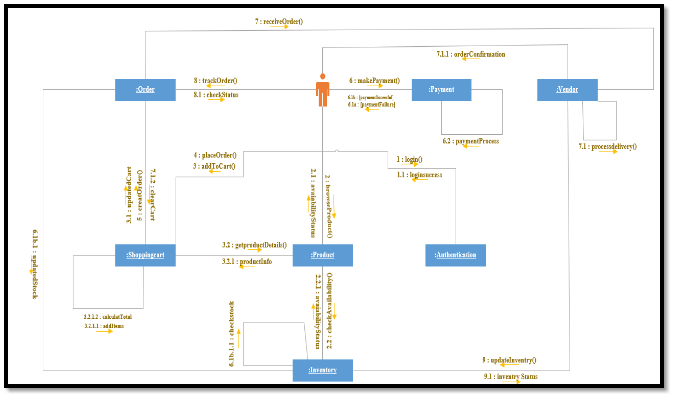

#

# **15. Component Diagram:**

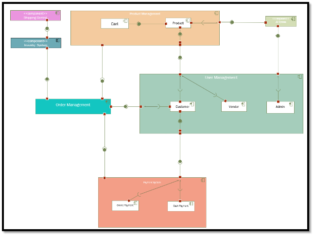

# **16. Package Diagram:**
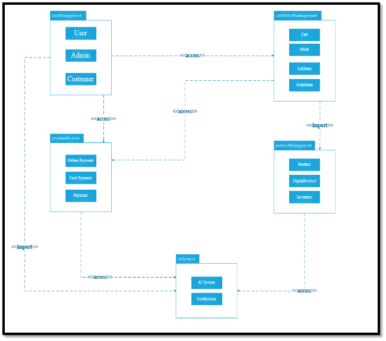

# **17. Deployment Diagram:**
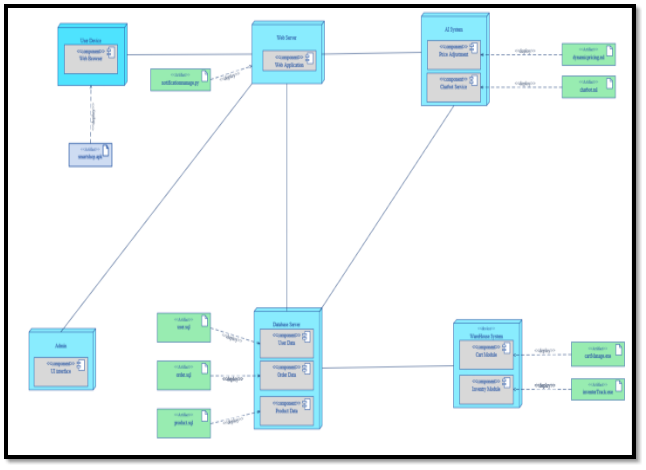

# **18. Data Flow Diagram**
## **18.1 Level:**
##
## 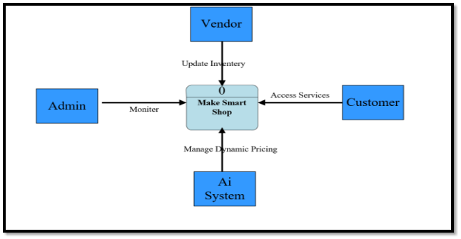
##
##
##
##
##
##
##
##
##
##
##
##
##
##
##
## **18.2 Level 1:**

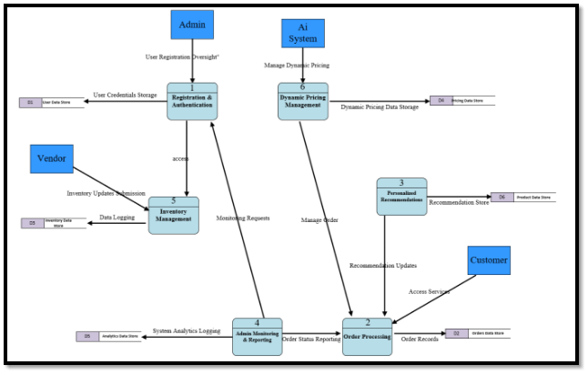
##
##
##
##
##
##
##
##
##
##
##
##
## **18.3 Level 2:**

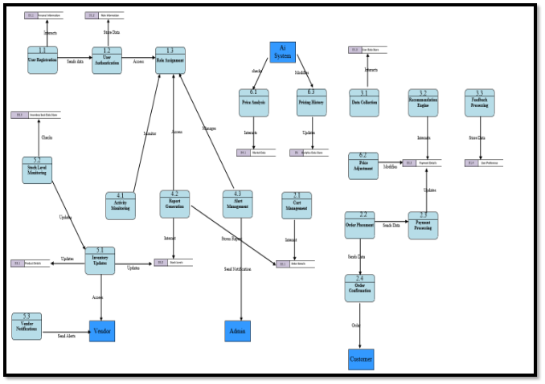

# **19. GOF (Design Patterns):**

## **19.1 Creational Patterns (Singleton Pattern):**

### `		`**19.1.1. Admin Class:** 
**Name:                   Singleton**

**Problem:** Ensuring consistent system management requires a single admin instance.

**Solution:** The Admin class uses a private constructor and a static variable to enforce a single instance, ensuring centralized control and avoiding conflicts.

**Consequences:** Centralizes control, ensuring consistency. Limits flexibility for multiple admins in the future.

- **Code:**
- public class AISystem {
- `    `private static AISystem instance;

- `    `// Private constructor to prevent object creation
- `    `private AISystem() {}

- `    `public static AISystem getInstance() {
- `        `if (instance == null) {
- `            `instance = new AISystem();
- `        `}
- `        `return instance;
- `    `}

- `    `// AI-related methods
- `    `public void analyzeBehavior() {
- `        `// Analyze user behavior
- `    `}

- `    `public void generateTrend() {
- `        `// Generate trending items
- `    `}
- }

###
### **19.1.2. AI System Class**
**Name:                   Singleton**

**Problem:** Maintaining efficient and consistent AI processing requires a single AI instance.

**Solution:**  The AI System employs a private constructor and a static reference to ensure a single instance, enabling centralized processing and resource efficiency.

**Consequences:** Reduces redundancy and ensures consistency. Limits concurrent handling of diverse payment methods.

- **Code:**
- public class Payment {
- `    `private static Payment instance;

- `    `// Private constructor to prevent object creation
- `    `private Payment() {}

- `    `public static Payment getInstance() {
- `        `if (instance == null) {
- `            `instance = new Payment();
- `        `}
- `        `return instance;
- `    `}

- `    `// Payment-related methods
- `    `public void processPayment() {
- `        `// Process the payment
- `    `}
- }

##
## **19.2 Structural Patterns (Adapter Pattern):**

### **19.2.1. Payment Gateway Class**
**Name:                   Adapter**

**Problem:** Different payment gateways have incompatible interfaces**.**

**Solution:** Adapters like SadaAdapter and PayPalAdapter bridge the gap by adapting specific methods to a common PaymentGateway interface**.**

**Consequences:** Simplifies integration of diverse gateways. Adds complexity through multiple adapter classes.

- **Code:**
- // External Payment Gateway 1
- class SadaPaymentGateway {
- `    `public void sadaPayment(String customer, double amount) {
- `        `System.out.println("Sada payment of $" + amount + " for " + customer);
- `    `}
- }

- // External Payment Gateway 2
- class PayPalPaymentGateway {
- `    `public void paypalTransaction(String customerEmail, double amount) {
- `        `System.out.println("PayPal: Payment of $" + amount + " processed for " + customerEmail);
- `    `}
- }

- // Target Interface
- interface PaymentGateway {
- `    `void processPayment(String customer, double amount);
- }

- // Adapter for Stripe
- class SadaAdapter implements PaymentGateway {
- `    `private SadaPaymentGateway stripeGateway;

- `    `public SadaAdapter() {
- `        `this.stripeGateway = new SadaPaymentGateway();
- `    `}

- `    `@Override
- `    `public void processPayment(String customer, double amount) {
- `        `stripeGateway.sadaPayment(customer, amount); // Adapting to Stripe's method
- `    `}
- }

- // Adapter for PayPal
- class PayPalAdapter implements PaymentGateway {
- `    `private PayPalPaymentGateway payPalGateway;

- `    `public PayPalAdapter() {
- `        `this.payPalGateway = new PayPalPaymentGateway();
- `    `}

- `    `@Override
- `    `public void processPayment(String customer, double amount) {
- `        `payPalGateway.paypalTransaction(customer, amount); // Adapting to PayPal's method
- `    `}
- }

- // Client Code
- public class AdapterPatternExample {
- `    `public static void main(String[] args) {
- `        `// Using Stripe
- `        `PaymentGateway sadaPayment = new SadaAdapter();
- `        `sadaPayment.processPayment("Alice", 150.00);

- `        `// Using PayPal
- `        `PaymentGateway paypalPayment = new PayPalAdapter();
- `        `paypalPayment.processPayment("bob@example.com", 200.50);
- `    `}
- }

- **Diagram :**

## **19.3 Behavioral Patterns (Observer Pattern):**

### **19.3.1.  Inventory Class:** 
**Name:                   Observer**

**Problem:** Components like the UI and notifications need updates when stock changes.

**Solution:** The Inventory class notifies registered observers, ensuring all components are synchronized with stock updates.**.**

**Consequences:** Enhances maintainability through decoupling. Performance can degrade with frequent updates and many observers.

- **Code:**
- import java.util.ArrayList;
- import java.util.List;

- // Subject (Observable)
- class Inventory {
- `    `private List<Observer> observers = new ArrayList<>();
- `    `private int stock;

- `    `public void addObserver(Observer observer) {
- `        `observers.add(observer);
- `    `}

- `    `public void removeObserver(Observer observer) {
- `        `observers.remove(observer);
- `    `}

- `    `public void setStock(int stock) {
- `        `this.stock = stock;
- `        `notifyObservers();
- `    `}

- `    `public int getStock() {
- `        `return stock;
- `    `}

- `    `private void notifyObservers() {
- `        `for (Observer observer : observers) {
- `            `observer.update(stock);
- `        `}
- `    `}
- }

- // Observer Interface
- interface Observer {
- `    `void update(int stock);
- }

- // Concrete Observers
- class UI implements Observer {
- `    `@Override
- `    `public void update(int stock) {
- `        `System.out.println("UI updated: Stock is now " + stock);
- `    `}
- }

- class Notifications implements Observer {
- `    `@Override
- `    `public void update(int stock) {
- `        `System.out.println("Notification sent: Stock updated to " + stock);
- `    `}
- }

- // Main Class
- public class ObserverPatternExample {
- `    `public static void main(String[] args) {
- `        `Inventory inventory = new Inventory();

- `        `// Create Observers
- `        `UI ui = new UI();
- `        `Notifications notifications = new Notifications();

- `        `// Register Observers
- `        `inventory.addObserver(ui);
- `        `inventory.addObserver(notifications);

- `        `// Simulate Stock Updates
- `        `inventory.setStock(50); // Notify all observers
- `        `inventory.setStock(30);
- `    `}
- }

- **Diagram**

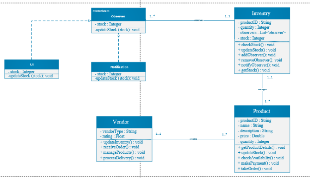

}

# **20. GRASP (Design Patterns):**
## **20.1 Creator:**
### **20.1.1.  Vendor and Product**
**Name:                   Creator**

**Problem:** Who should be responsible for creating Product instances for a Vendor?

**Solution:** The Vendor class should create Product instances as it aggregates and closely manages them. This ensures better cohesion and control over product creation. By centralizing the product creation within the Vendor class, you maintain a clean responsibility structure.
###
### **20.1.2.  Inventory and Product**
**Name:                   Creator**

**Problem:** Who should be responsible for creating Product instances for inventory management?

**Solution:** The Inventory class should create and manage Product instances, as it controls the stock and product information. This aligns with the Inventory's role in managing product availability. By centralizing this responsibility, the system avoids scattered creation logic and maintains clear ownership.

##
## **20.2 Information Expert:**

**Name:                   Information Expert**

**Problem:** The Inventory class should manage stock data, but Product or Vendor handling stock operations violates the Information Expert principle.

**Solution:** Assign stock-related responsibilities to the Inventory class to maintain efficient task management. The Inventory should store stock data and provide stock-related methods like checkStock() and updateStock(). This ensures proper separation of concerns and prevents misuse of product and vendor classes.
## **20.3 Controller:**

**Name:                   Controller**

**Problem:** If your Order Controller doesn’t handle all user events related to orders, it may lead to confusion and inefficiencies.

**Solution:** Ensure the Order Controller handles all relevant user events such as adding items, checking out, and viewing the cart. Delegate complex tasks like pricing calculations and payment processing to specialized services. Implement the MVC pattern to separate concerns and improve system maintainability.

## **20.4 Low Coupling:**

**Name:                   Low Coupling**

**Problem:** If the Payment classes are directly connected to external payment services like PayPal or Sadapay, changes in those services could break the system..

**Solution** Use a Payment Gateway Adapter to act as an intermediary between the Payment classes and external payment services. This decouples the system from the specifics of payment services. By using dependency injection, the system can easily switch between payment services without affecting other components.

## **20.5 High Cohesion:**

**Name:                   High Cohesion**

**Problem:** The Pricing Engine might be responsible for too many tasks, such as applying discounts or calculating taxes, which violates high cohesion.** 

**Solution** Refactor the Pricing Engine to focus solely on pricing calculations. Move other responsibilities like discounts, taxes, and promotions to separate classes. This keeps the Pricing Engine focused on its core task and makes the system more modular and maintainable.

## **20.6 Polymorphism:**

**Name:                   Polymorphism**

**Problem:** If discount types (e.g., percentage, fixed) are implemented as separate, non-polymorphic classes, it can lead to code duplication.

**Solution:** Implement a DiscountRule interface or abstract class, and create subclasses for each discount type (e.g., PercentageDiscount, FixedDiscount). This allows the system to treat all discount types uniformly and extend the system easily by adding new discount types.
## **20.7 Pure Fabrication:**

**Name:                   Pure Fabrication** 

**Problem:** The Admin class is responsible for generating reports, violating the Pure Fabrication principle.** 

**Solution:** Introduce a Report Generator class dedicated to generating reports such as sales or inventory. Refactor the Admin class to delegate report generation tasks to this new class. This ensures better separation of concerns and improves system modularity.
##
##
##
## **20.8 Indirection:**

**Name:                   Indirection** 

**Problem:** If the system communicates directly with external recommendation engines, it could lead to tight coupling and complicate future changes.

**Solution:** Introduce an API Gateway as an intermediary between the internal system and external engines. The API Gateway will handle communication, decoupling the internal system from the specifics of external services. It also enables easier upgrades, switching between engines, and enhances system security and scalability.

2 | Page

